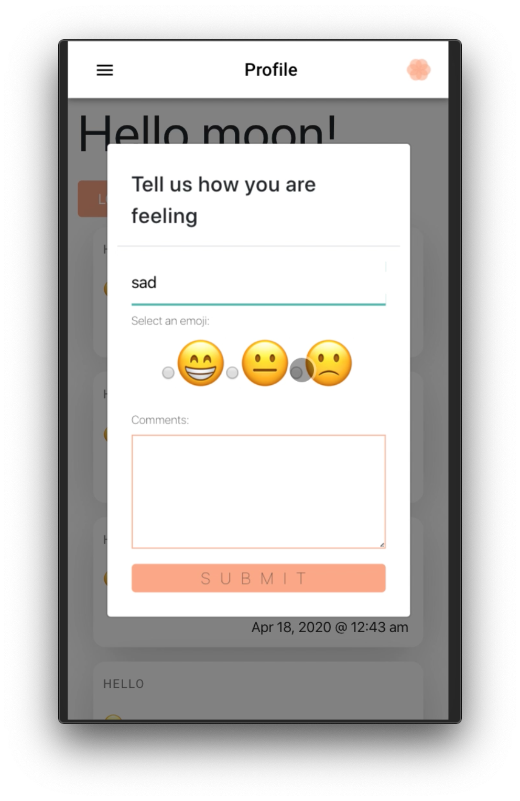
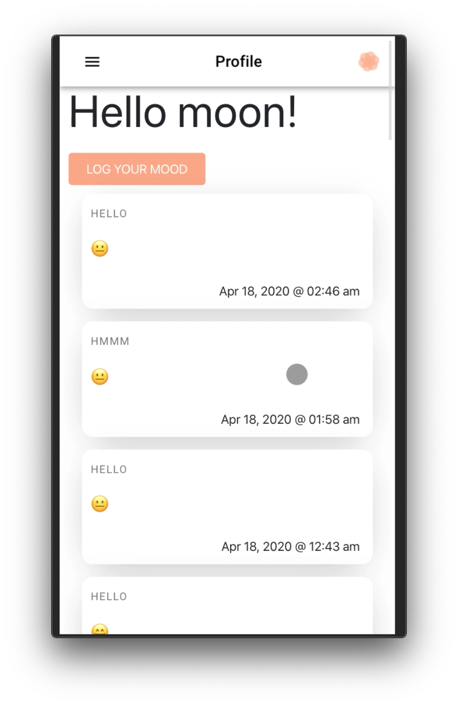
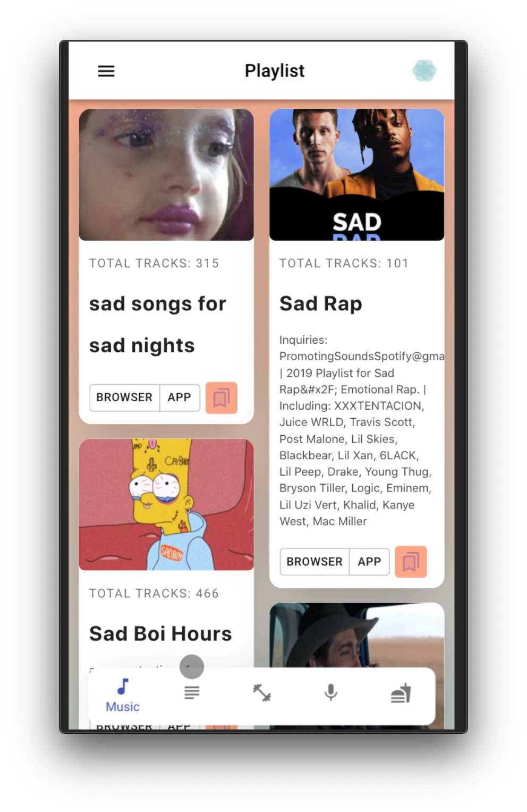
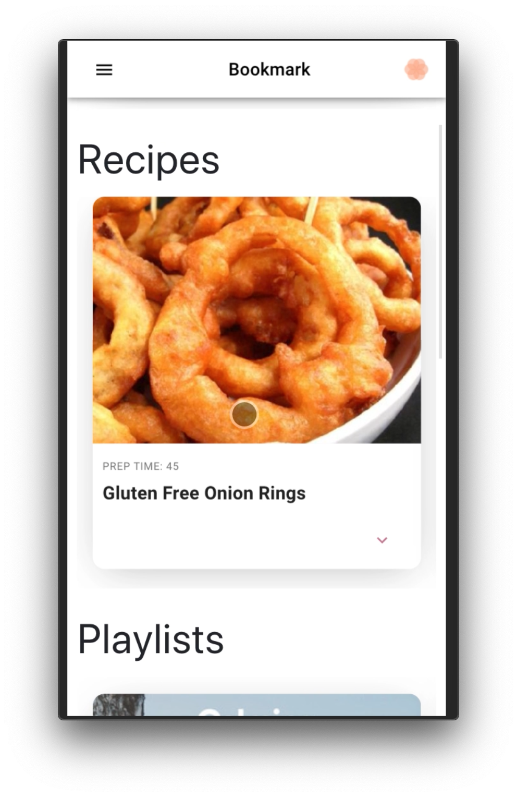
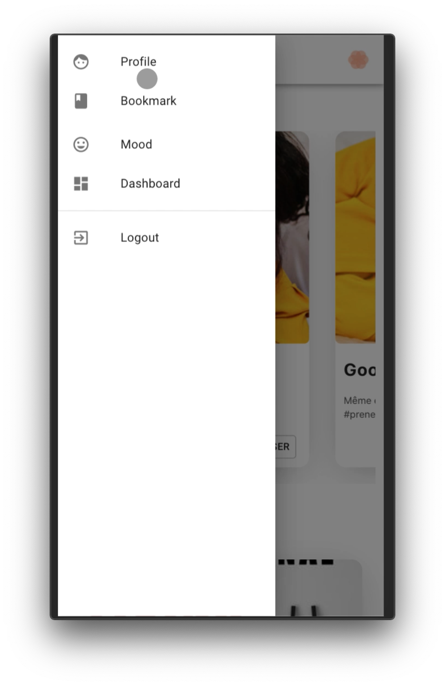

# Bloom

Bloom is a mobile based mood tracking app that helps users track their mood patterns and manage it with the app’s self-improvement features.

## Overview

### Concept

The concept for Bloom was inspired by the rising need for mental health management due to the events caused by the global pandemic of Covid-19.

### Features

Bloom requires a user to log in their mood in order to access its features.
Each mood selection would render a specific profile and dashboard that are customized to help the user manage their state of emotion.

### Images

## Technical Overview

### Dependencies/Utilized Technologies

- Node.js
- Express.js
- JWT
- Mongoose
- React
- API

### Live App

[Live Heroku App](https://projectbloom.herokuapp.com/)

## Contributors

- [Pamela Vasquez](https://github.com/pamelv)
- [Moon Jo](https://github.com/moon-mnny)
- [Chloe Choi](https://github.com/chloec222)
